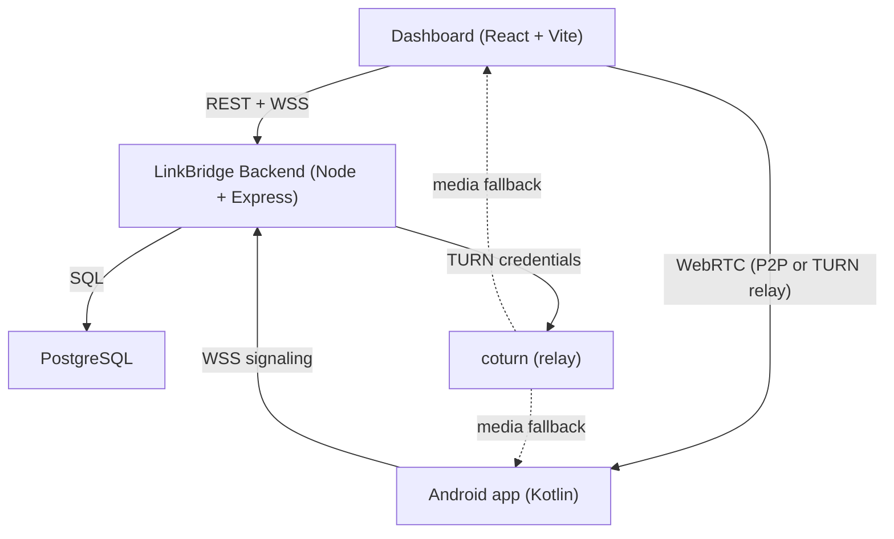
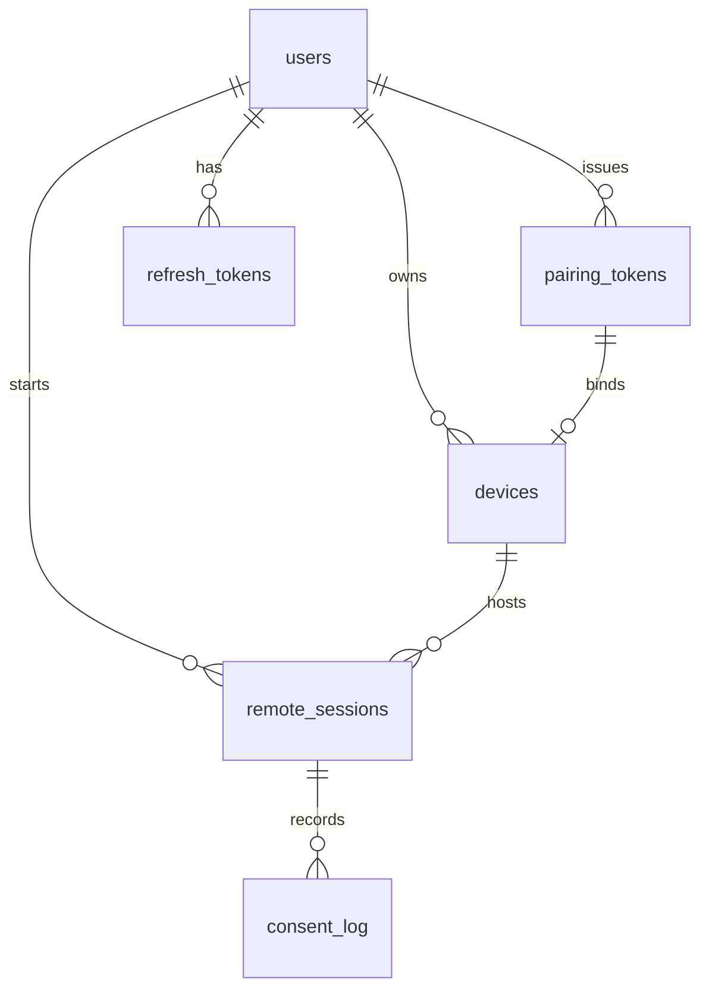
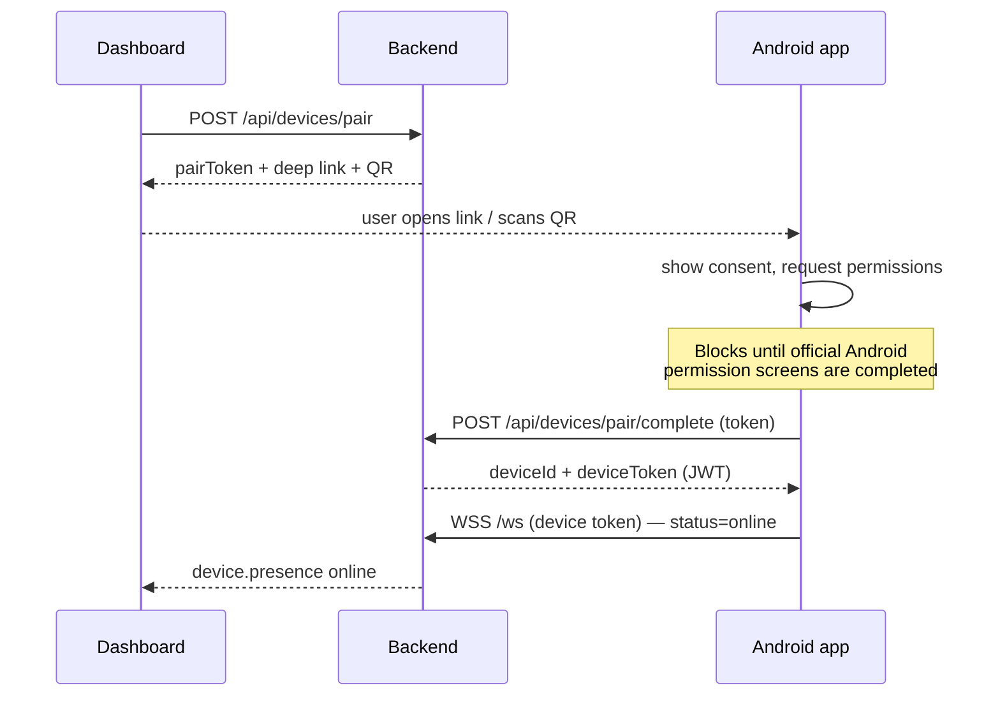
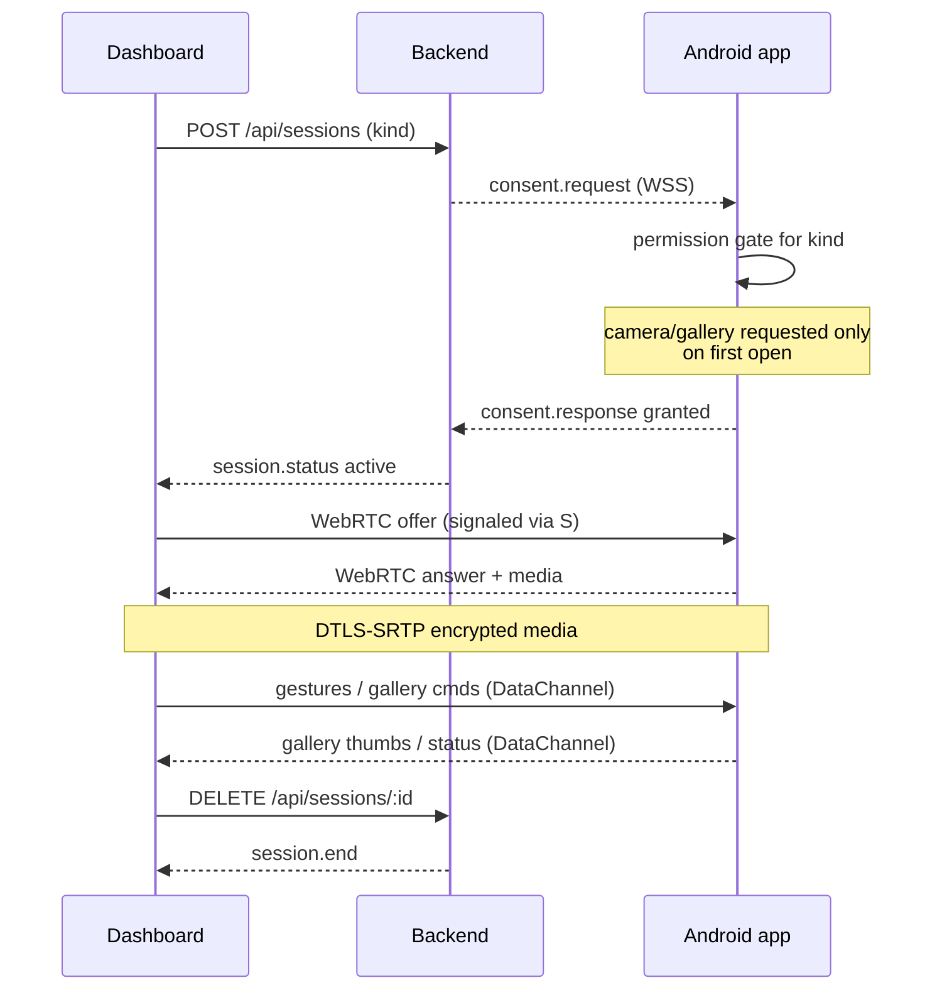

# LinkBridge — Architecture

LinkBridge is a self-hosted remote access platform for **your own** Android
devices. This document describes the system's design, components, and data
flows.

## High-level layout

Three components:

1. **Web dashboard** (`web/`) — React + TypeScript + Tailwind. Login, device
   list, pairing QR/link, and the remote room (live screen, touch, camera,
   gallery).
2. **Backend** (`server/`) — Node.js + Express + PostgreSQL. Auth, device
   pairing, session/consent state machine, WebSocket signaling server, and
   TURN credential issuance.
3. **Android app** (`android/`) — Kotlin. Deep-link pairing, guided
   permission flow, WebRTC screen/camera streaming, touch injection, and
   gallery browsing.

## Data model

Key invariants enforced by the schema and code:

- **Pairing tokens are single-use.** Only the SHA-256 hash is stored; a DB
  leak never yields a usable token.
- **Sessions are consent-gated.** A session starts in `consent_required` and
  only becomes `active` after the device user explicitly approves.
- **Every decision is audited** in `consent_log`.

## Pairing flow

## Remote session flow (screen / camera / gallery)

## Connection model

- **Signaling** runs over WSS on `/ws`, authenticated with an owner JWT
  (dashboard) or a device JWT (Android).
- **Media** runs over WebRTC. The dashboard is the offerer; the Android app
  answers and sends video.
- **Relay fallback**:
  - Media: TURN credentials issued by the backend (coturn-compatible REST
    API) are included in the session detail (dashboard) and the consent
    request (device).
  - Control: if the WebRTC data channel cannot be established, control
    messages transparently fall back to the signaling WebSocket
    (`relay.data`).

## Security boundaries

- TLS everywhere (API, WebSocket, WebRTC DTLS-SRTP).
- Scrypt password hashing with per-user salt; rotating refresh-token
  families with reuse detection.
- One-time pairing tokens; device-scoped JWTs; consent required per session.
- Android: no permission is ever bypassed. Notifications, MediaProjection,
  Accessibility, Camera, and Gallery all go through official system flows.
- Deliberately **not** implemented: file transfer, clipboard, SMS, contacts,
  call logs, notifications read, microphone, and location.

See `docs/SECURITY.md` for the full threat model.
